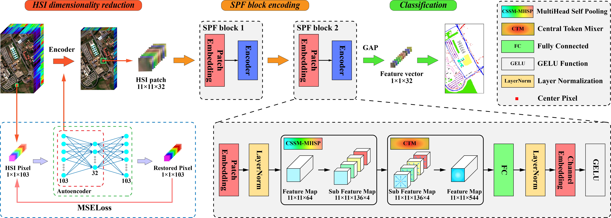
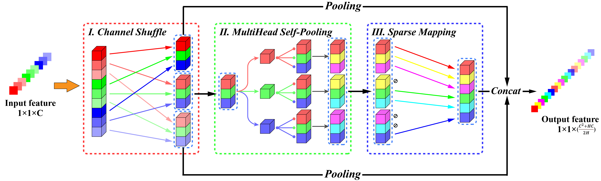

# SPFormer: Self-Pooling Transformer for Few-Shot Hyperspectral Image Classification

[Ziyu Li](https://www.researchgate.net/profile/Ziyu-Li-28), [Zhaohui Xue](https://sites.google.com/site/zhaohuixuers), Qi Xu, Ling Zhang, Tianzhi Zhu, [Mengxue Zhang](https://scholar.google.com/citations?user=To-g0UkAAAAJ)

___________

This is a slim implementation of the ["SPFormer: Self-Pooling Transformer for Few-Shot Hyperspectral Image Classification"](https://ieeexplore.ieee.org/document/10371361), and the official release please sees [here](https://github.com/ZhaohuiXue/SPFormer).

**Figure 1: The overview of Self-Pooling Transformer, including three stages: HSI dimensionality reduction, SPF block encoding, Classification.**

**Figure 2: Spectral token mixer module in SPFormer.**

**Figure 3: Spatial token mixer module in SPFormer.**

Citation
---------------------

**Reproductions of our model and experiments are welcome, and citations to our paper will be greatly appreciated!**

Z. Li, Z. Xue, Q. Xu, L. Zhang, T. Zhu and M. Zhang, "SPFormer: Self-Pooling Transformer for Few-Shot Hyperspectral Image Classification," in IEEE Transactions on Geoscience and Remote Sensing, vol. 62, pp. 1-19, 2024, Art no. 5502019, doi: 10.1109/TGRS.2023.3345923.

    @ARTICLE{10371361,
        author={Li, Ziyu and Xue, Zhaohui and Xu, Qi and Zhang, Ling and Zhu, Tianzhi and Zhang, Mengxue},
        journal={IEEE Transactions on Geoscience and Remote Sensing}, 
        title={SPFormer: Self-Pooling Transformer for Few-Shot Hyperspectral Image Classification}, 
        year={2024},
        volume={62},
        number={},
        pages={1-19},
        keywords={Transformers;Feature extraction;Training;Convolutional neural networks;Prototypes;Mixers;Data models;Autoencoder;channel shuffle (CS);few-shot learning (FSL);hyperspectral image (HSI) classification;self-pooling;Transformer},
        doi={10.1109/TGRS.2023.3345923}
    }
    
Requirements
---------------------
Running environment and required packages:
    
    python==3.8
    numpy==1.19.5
    matplotlib==3.3.4
    scipy==1.5.2
    scikit-learn==0.23.2
    opencv-python==4.5.1.48
    torch==1.10.2+cu111

Instructions for usage
---------------------

    AutoEncoder.py ...... Train an autoencoder for hyperspectral image dimensionality reduction and save the .pt file.
    SelfPoolingTransformer.py ...... A script for the implementation of SPFormer.
    main.py ...... A main script for hyperspectral image classification.
    data.py ...... A data processing script for hyperspectral image.
    loop_train_test.py ...... Perform iterative training and testing loops, saving the model weights in the 'save\models' directory, and storing the confusion matrix of the test results in the 'save\results' directory.
    loss_function.py ...... A script for calculating training loss.

1. Begin by executing AutoEncoder.py to initiate the training of the autoencoder for the specific dataset. It is advised to set the training iterations to a minimum of 50. Manually save the model with the lowest loss, and take note of the file path for the corresponding .pt file.
2. Proceed to run main.py for model training and testing on the specified dataset. Ensure that you accurately input the autoencoder's file path into the designated dictionary variable before initiating the process.
